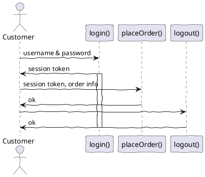
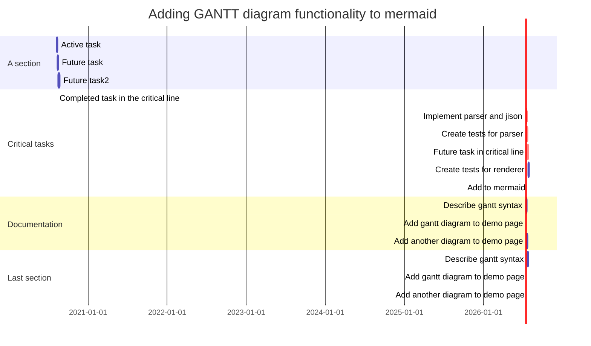
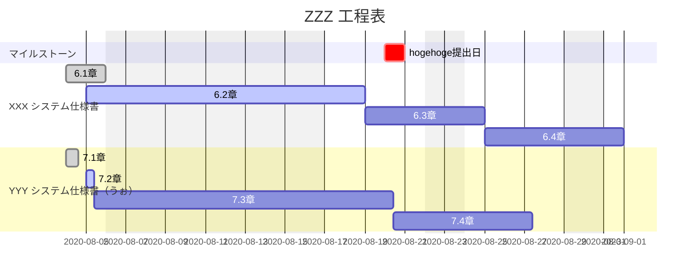

# test
## test
### plant uml sample

```plantuml
@startuml
    skinparam handwritten true
    actor Customer
    Customer -> "login()" : username & password
    "login()" -> Customer : session token
    activate "login()"
    Customer -> "placeOrder()" : session token, order info
    "placeOrder()" -> Customer : ok
    Customer -> "logout()"
    "logout()" -> Customer : ok
    deactivate "login()"
@enduml
```

### mermaid uml sample

```mermaid
graph TD;
    A-->B;
    A-->C;
    B-->D;
    C-->D;
```

```mermaid
gantt
       dateFormat  YYYY-MM-DD
       title Adding GANTT diagram functionality to mermaid

       section A section
       Active task               :active,  des2, 2020-08-09, 3d
       Future task               :         des3, after des2, 5d
       Future task2              :         des4, after des3, 5d

       section Critical tasks
       Completed task in the critical line :crit, done, 2020-08-06,24h
       Implement parser and jison          :crit, done, after des1, 2d
       Create tests for parser             :crit, active, 3d
       Future task in critical line        :crit, 5d
       Create tests for renderer           :2d
       Add to mermaid                      :1d

       section Documentation
       Describe gantt syntax               :active, a1, after des1, 3d
       Add gantt diagram to demo page      :after a1  , 20h
       Add another diagram to demo page    :doc1, after a1  , 48h

       section Last section
       Describe gantt syntax               :after doc1, 3d
       Add gantt diagram to demo page      :20h
       Add another diagram to demo page    :48h
```

```mermaid
gantt
       dateFormat  YYYY-MM-DD
       title ZZZ 工程表
       excludes weekends 2020-08-06 2020-08-07 2020-08-10 2020-08-11 2020-08-12 2020-08-13 2020-08-14
       %% 今日を表す縦線
       todayMarker stroke-width:5px,stroke:#0f0,opacity:0.5

    %% マイルストーンの表現(仮)
       section マイルストーン
       hogehoge提出日               :  crit,m1, 2020-08-20, 1d

       section XXX システム仕様書
       6.1章               :done,  ntask1, 2020-08-04, 2d
       6.2章               :active,  ntask2, 2020-08-05, 3d
       6.3章               :         ntask3, after ntask2, 4d
       6.4章              :         ntask4, after ntask3, 5d

    %% 担当者の表現方法？色変更とか
    %% 進捗率の表現
       section YYY システム仕様書（うぉ）
       7.1章            :done,  mtask1, 2020-08-04, 15h
       7.2章               :active,  mtask2, 2020-08-05, 10h
       7.3章               :         mtask3, after mtask2, 4d
       7.4章              :         mtask4, after mtask3, 5d
```
@import "gantt.css"